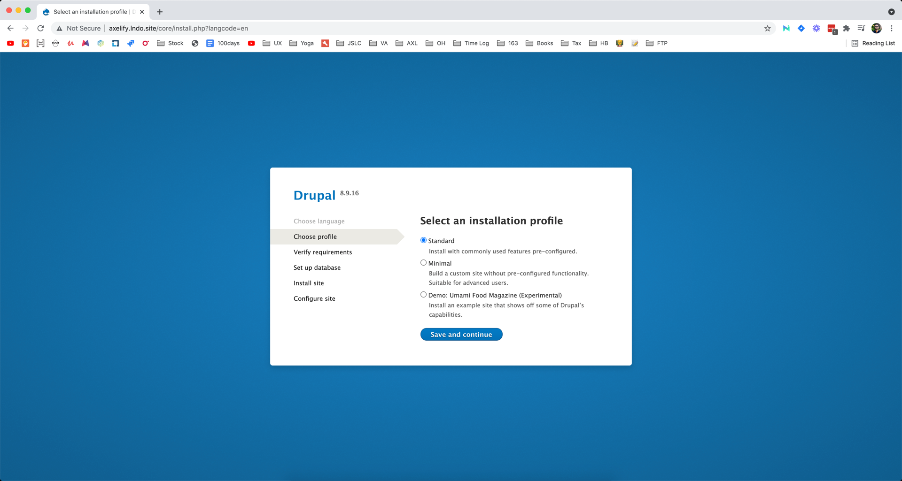
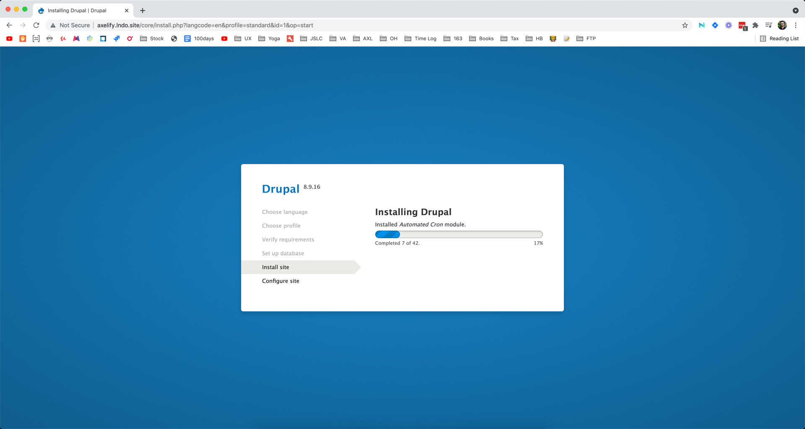
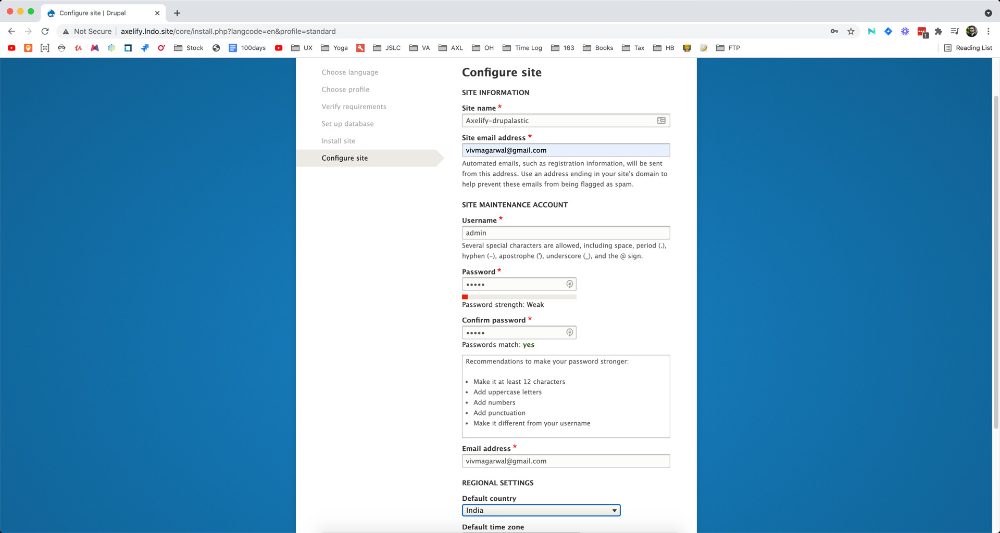
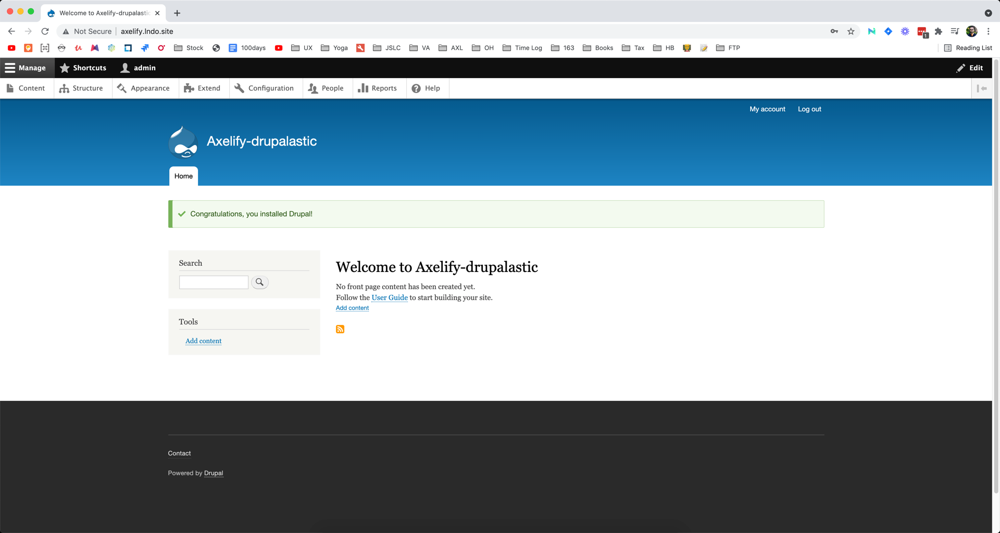
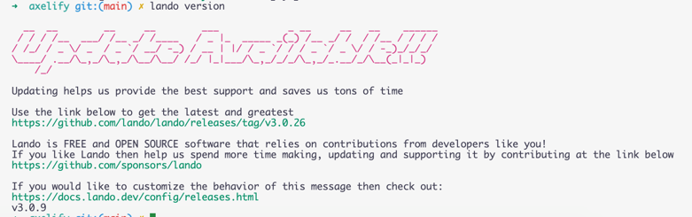
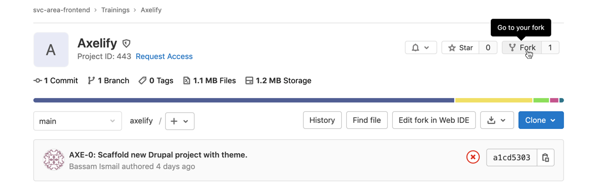
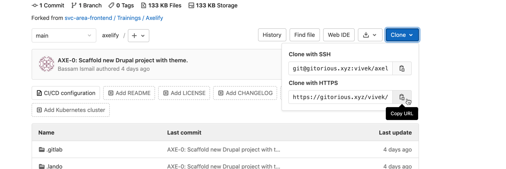
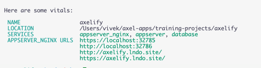

# Local setup guide

## Using ddev [recommended for everyone]

1. check if `lando` is installed in your system. You may check that using the command `lando version`. If it's not in your system you may ignore this step. But if it's installed, please run the following command:
   - `lando poweroff` (You need to run this only if you get an output from `lando version`)

2. update brew
   - `brew update`

4. install ddev
   - `brew install drud/ddev/ddev`
   - `mkcert -install`
   - `ddev start`

5. quick checks:
   - check if composer is working properly
      `ddev composer`
   - check if drush is working properly
      `ddev drush`
   - check if node is working properly
      `ddev exec -d /var/www/html/web/themes/custom/drupalastic node --version`

6. final steps
   - `ddev composer install`
   - `ddev start`

7. `ddev start` will generate the local urls to access the website after ddev completes the start process.

8. Goto [https://axelify.ddev.site/](https://axelify.ddev.site/)

9.  Choose the relevant options:

It may take some time to install Drupal

10.  Finally configure the site

11.  And your local Drupal instance is Ready:

12. node tasks
   - ddev exec -d /var/www/html/web/themes/custom/drupalastic npm i
   - ddev exec -d /var/www/html/web/themes/custom/drupalastic npm run build:all
   - ddev exec -d /var/www/html/web/themes/custom/drupalastic npm run watch:all

## Using lando [temporarily discontinued]

1. Make sure that the [lando in installed in your system](https://docs.lando.dev/basics/installation.html)

If you type lando version in your terminal, you should be able to see an output similar to the following:

2. Fork the following repo: https://gitorious.xyz/svc-area-frontend/trainings/axelify

3. Copy the Clone with HTTPS URL

4. Clone the repo on your local using the following command
`git clone <url-copied-in-step-3>`

5. Make sure that you are in the `axelify` directory

6. Run `lando composer install`

This can take some time based on internet speeds.

7. Run `lando start`

Lando will generate the local urls to access the website after lando completes the start process.

8. Goto [http://axelify.lndo.site/](http://axelify.lndo.site/)

9. Choose the relevant options:

It may take some time to install Drupal

10.  Finally configure the site

11.  And your local Drupal instance is Ready:
